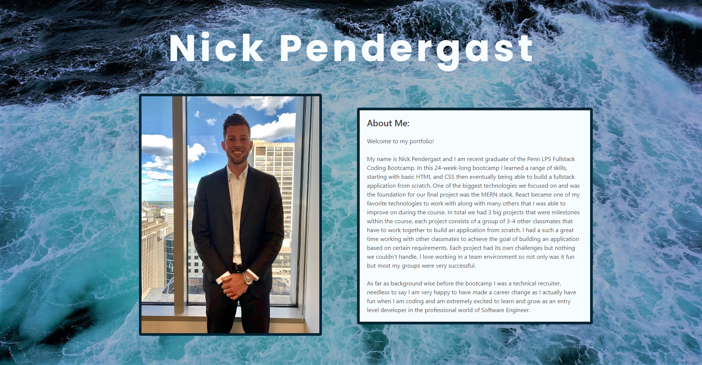

# My-Portfolio

## Description

Hello and welcome to my professional portfolio! This website has been created to showcase all my projects and assignments that I have completed during the Penn LPS Full stack development Bootcamp that I recently graduated from! On the website you will be able to learn more about me, the technologies I learned/used and some of the applications I built. Right now, all the applications are from the bootcamp course work but hopefully soon I will have some applications on there that I have built outside of the class. The applications I am most proud of are the 3 projects we as a team were able to complete and build. For every project I worked on not only was I a lead developer but also a project manager. Please feel free to check out my professional portfolio by clicking on the “Usage” links down below!   

## Usage

To view my work click on the deployed link down below. After that you will be directed to the home page where you can navigate the website and learn more about me and my projects!  

GitHub pages: https://nbp77.github.io/My-Portfolio/#/

## Technologies used:

- React 
- Javascript 
- Bulma 
- CSS
- emailJS

## Questions

For any questions please do not hesitate to reach out at:

nbp77@outlook.com 

